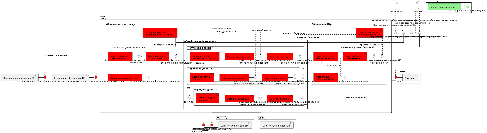

# Условия использования 

Условия использования и распространения - MIT лицензия (см. файл LICENSE).

## Настройка и запуск

### Системные требования

### Используемое ПО

### Настройка окружения и запуск примера

### Концепция безопасности

[Концепция безопасности](./docs/SecurityConcept.md)

### Компоненты

| Название | Назначение | Комментарий |
|----|----|----|
|*device* | Непосредственно устройство детектирования. Принимает данные от аналогового датчика (sensor), передает сообщения на Пульт управления (scada), обрабатывает процедуры обновления и т.д. | - |
|*file_server* | Поскольку в реализации подразумевалось, что инженеры загружают обновление напрямую в устройство, то для эмуляции этого процесса был использован данный компонент. Его стоит рассматривать как подключенное к device устройство, с которого при успешной аутентификации ключей скачивается на device обновление. Поэтому в т.ч. обладает своей памятью в ./data, где и лежит "обновление". | - |
|*protection_system* | Эмулятор системы защиты станции. При выявлении превышающего порог значения в device, сюда отправляется сообщение, чтобы "сработала" защита. | - |
|*scada*  | Эмулятор пульта управления станцией. Получает все данные (значения, сообщения об ошибках и т.д.) от device.  | - |
|*sensor* | Эмулятор аналогового датчика, который раз в заданное время подает сгенерированный в заданном диапазоне сигнал через HTTP в device.  | - |
|*storage* | Фактически это лишь папка с данными, которая является эмулятором некоторой физической памяти устройства device. | - |

### Диаграмма компонентов

В качестве базовой была взята диаграмма компонентов похожая на разобранную в учебных материалах. При этом для этой схемы рассматриваются следующие предположения: 
* менеджер безопасности с интерфейсом брокера сообщений предполагаются точно доверенными; 
* Внешние сущности (датчик, АСУ ТП, СУЗ и хранилища обновлений ПО и конфигурации) - нейтральные (так как мы на них не влияем и предполагаем, что с ними все в порядке), но интерфейсы взаимодействия с УД предполагаются недоверенными.
* Все внутренние сущности УД - недоверенные

### Подсистемы

Задание предполагает следующие подсистемы УД:

* Подсистема обработки данных датчика
* Подсистема обновлений
* Подсистема журналирования

Описание архитектуры каждой из подсистем:

[Архитектура подсистемы обработки данных датчика](./docs/ArchSensorDataProcessing.md)

[Архитектура подсистемы обновлений](./docs/ArchUpdateDevice.md)

[Архитектура подсистемы журналирования](./docs/ArchLogging.md)

### Практические результаты

Удалось реализовать примерную логику работы узлов устройства, описанных в [архитектуре подсистемы обработки датчика](./docs/ArchSensorDataProcessing.md):
* Блок получения данных (docker CDataInput)
* Блок обработки данных (docker CDataProc)
* Блок порогового сравнения (docker CDataComparator)
* Блок передачи данных (docker CDataOutput)
* Блок подписи (docker CDataSign)
* Блок проверки подписи (docker CDataVerifySign)
* Взаимодействие с блоками датчика, СУЗ и АСУ ТП (без проверки подписи на этих внешних компонентах)

Данные датчика с меткой времени подписываются в блоке получения данных, проверяются в блоке порогового сравнения. При нарушенной подписи передача данных в СУЗ не происходит.

Для проверки работоспособности необходимо выполнить следующие действия:

make prepare

make run

docker-compose stop FakeCDataProc

docker-compose stop CDataProc

docker-compose up CDataProc

docker-compose up CDataComparator

По какой-то причине именно CDataComparator не запускается совместно со всеми контефнерами.

Журналы в приведенных выше контейнерах будут показывать обработку данных на соответствующих этапах.
Блоки АСУ ТП (docker scada)  И СУЗ будут принимать данные

### Тесты

Для тестов был создан дополнительный подставной блок обработки данных (docker FakeCDataProc), который заменяет значение на заведомо превосходящее порог.

Для проверки негативного теста:

make prepare

make run

docker-compose stop CDataProc

docker-compose stop FakeCDataProc

docker-compose up FakeCDataProc

docker-compose up CDataComparator

Журналы в приведенных выше контейнерах будут показывать обработку данных на соответствующих этапах.

Блоки АСУ ТП (docker scada) будет принимать данные с подписью 

СУЗ не будет принимать данные

