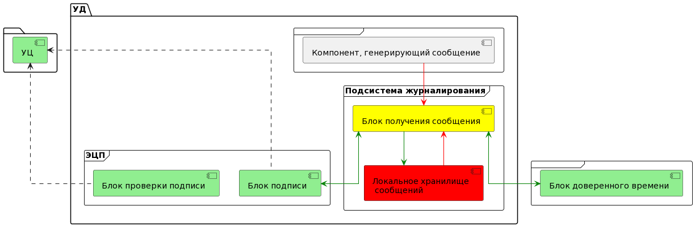
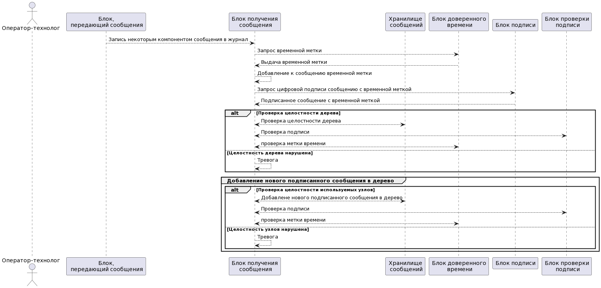
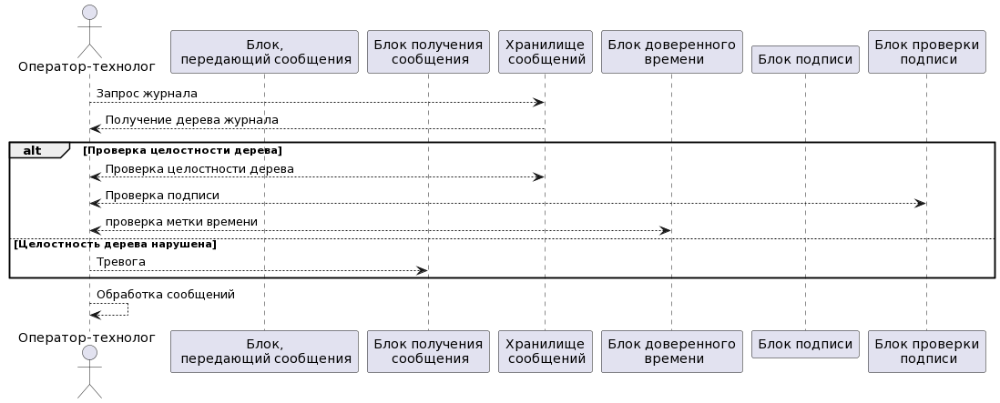
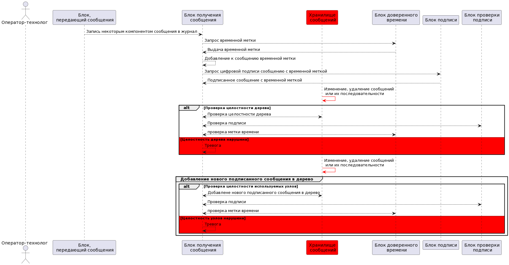
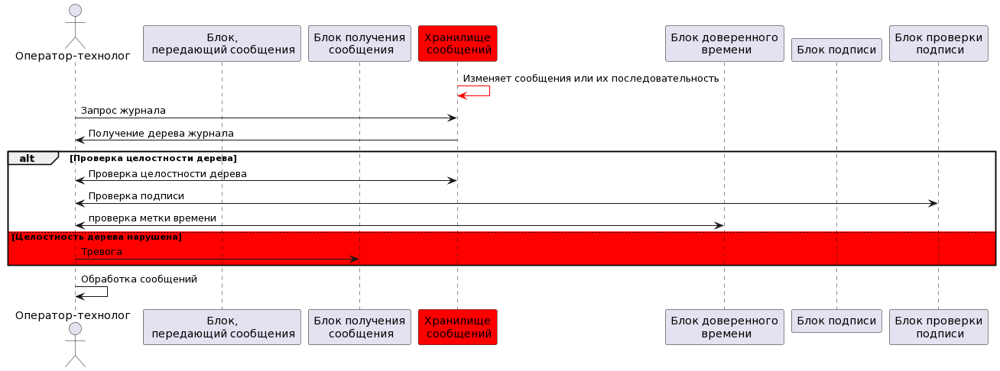

### Подсистема журналирования

Предлагается следующая архитектура подсистемы журналирования:

В качестве доверенных компонентов используются блоки подписи, проверки подписи и находящийся с ними в ассоцииации внешний УЦ, а также блок доверенного времени.

В качестве источника сообщений может выступать любой компонент системы. В худшем случае (это показано на схеме) его данные будут недоверенными.

Блок, получающий сообщения от некоторого произвольного компонента в системе является компонентом, повышающим доверие. Именно он взаимодействует с ЭЦП и блоком доверенного времени. Для возможности сделать локальное хранилище сообщений недоверенным компонентом данные хранятся в виде дерева Меркла. Блок получения сообщений в этом случае обращается к уже существующему дереву, проверяет его структуру, подписывает каждое сообщение, добавляет новый узел дерева и отправляет его в локальное хранилище сообщений.

Такая архитектура позволяет бороться со следующими возможными воздействиями:

* событие не зарегистрировано - все, попадающие в блок получения сообщений события обрабатываются компонентом, повышающим доверие
* событие пропало - при обработке повышающим доверие компонентом мы предполагаем, что событие не пропадает, а при изменении в локальном хранилище, мы получаем ситуацию нарушения конструкции дерева Меркла
* событие зарегистрировано с искажениями - искажения будут заметны при проверке подписи
* зарегистрировано событие, которого не было - добавление такого события в обход блока получения сообщений означает нарушение конструкции дерева Меркла

### Операции подсистемы журналирования

#### Запись сообщения в журнал

#### Чтение журнала 

### Негативные варианты

#### Запись сообщения в журнал

В недоверенном хранилище сообщений возможно удаление или изменение сообщений

Удаление или изменение сообщений обнаруживается при проверке дерева Меркла

#### Чтение журнала 

В недоверенном хранилище сообщений возможно удаление или изменение сообщений

Удаление или изменение сообщений обнаруживается при проверке дерева Меркла

При такой архитектуре сообщения журнальной информации либо не попадают в журнал, что можно косвенно отследить по сообщениям из доверенных компонентов по пути следования данных, либо являются целостными, либо проверка целостности возвращает ошибку. В таком случае, в цели безопасности можно дополнительно внести пункт также и о целостности журнальной информации.
