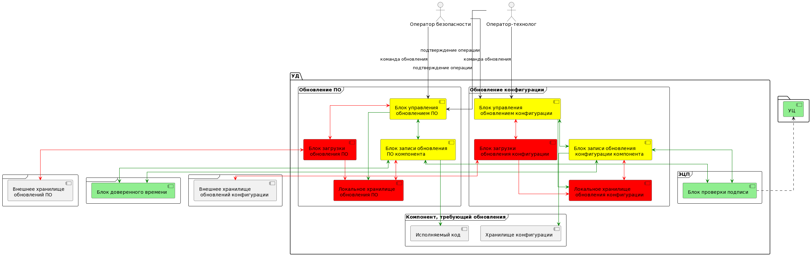
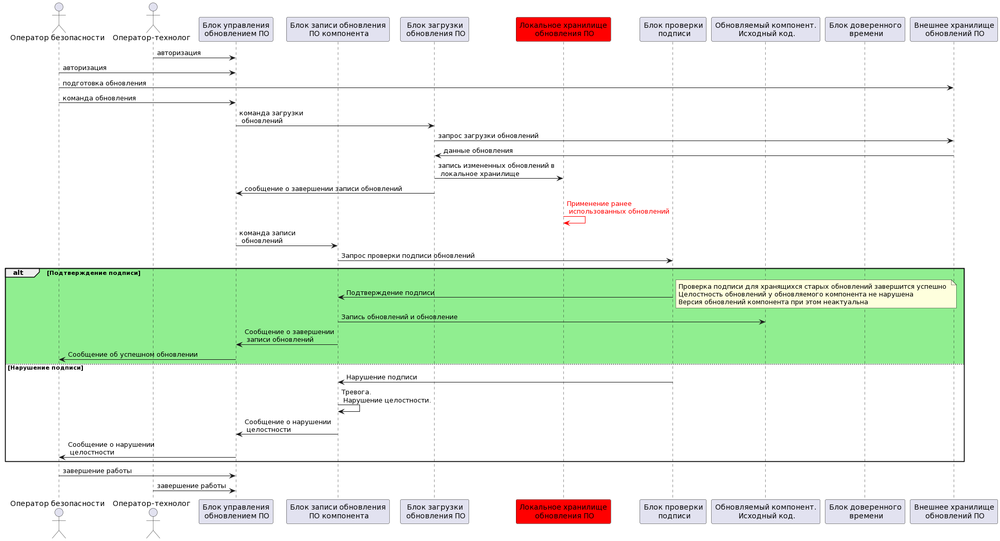

### Подсистема обновлений

Для задачи обеспечения целостности и корректности обновлений предлагается следующая архитектура:

В качестве доверенных компонентов используются также блок проверки подписи, блок доверенного времени и по ассоциации - УЦ.

Компоненты, повышающие доверие - блоки управления обновлениями и блоки записи обновления непосредственно в компонент, подлежащий обновлению.

В случае блока управления повышение доверия необходимо для выполнения цели безопасности о наличии оператора-технолога и оператора безопасности при обновлении.

Блок записи обновлений не требует повышения доверия так как в исходном документе цели безопасности о поддержании целостности кода и обновлений нет. Но так как мы используем механизм подписи и проверки, то можно такую цель безопасности обозначить и для ее выполнения обеспечить повышение доверия данного компонента.

Сам компонент, требующий обновления может быть, как доверенным, так и недоверенным, так как код и данные были проверены. В качестве замечания можно указать на то, что в зависимости от конкретной реализации, блок записи обновления может быть включен, например, в сам обновляемый компонент вместе с требуемыми проверками.

### Операции подсистемы обновлений

#### Обновление ПО

#### Обновление конфигурации 

### Негативные варианты

Устройство блоков обновления ПО и конфигурации схожи (отличия заключаются в активном учаснике обновления (оператор безопасности для ПО и оператор-технолог для конфигурации) а также в конечных обновляемых данных, исполняемый код для ПО и хранилище для конфигурации). Недоверенные компоненты этих блоков не затрагивают ни участников операций, ни обновляемый компонент. Таким образом,  негативные сценарии можно рассмотреть только для одного из блоков.

#### Нарушение в обработке данных в блоке загрузки обновления

В недоверенном блоке загрузки обновления могут возникать следующие ситуации:
* Блок загрузки данных, получив команду загрузки из внешнего хранилища не выполнил обращение к внешнему хранилищу.
* Блок загрузки данных, получив команду загрузки из внешнего хранилища обратился к внешнему хранилищу, но не выполнил загрузку в локальное хранилище. Данные в хранилище остались прежними. Целостность обновляемого компонента не нарушилась. (Если удалять данные после обновлений, то можно отследить ситуацию, когда блок загрузки ничего не делает)
* Блок загрузки данных, получив команду загрузки из внешнего хранилища записывает поддельные или измененные обновления в локальное хранилище.
* Блок загрузки данных, получив команду загрузки из внешнего хранилища записывает ранее примененные обновления в локальное хранилище.

Данные в хранилище остались прежними. Целостность обновляемого компонента не нарушилась (Если удалять данные после обновлений, то можно отследить ситуацию, когда блок загрузки ничего не делает)

Если журналировать действия на каждом компоненте, то по журнальной информации можно отследить где возникла проблема.

Данные в хранилище остались прежними. Целостность обновляемого компонента не нарушилась (Если удалять данные после обновлений, то можно отследить ситуацию, когда блок загрузки ничего не делает)

Если журналировать действия на каждом компоненте, то по журнальной информации можно отследить где возникла проблема.

Изменение в данных локального хранилище будет выявлено блоком записи обновления при проверке подписи. Целостность обновляемого компонента не нарушится.

Изменение в данных локального хранилище не будет выявлено блоком записи обновления при проверке подписи. Однако целостность обновляемого компонента не будет нарушена. Будет нарушена актуальность. В качестве цели безопасности актуальность заявлять не будем.

#### Нарушение в обработке данных в блоке локального хранилища обновления

В недоверенном блоке локального хранилища обновления могут возникать следующие ситуации:
* Локальное хранилище обновлений не заменяет обновления, имеющиеся в хранилище, новыми. Данные в хранилище остаются прежними.
* Локальное хранилище обновлений изменяет или формирует поддельные данные обновления

Данные в хранилище остались прежними. Целостность обновляемого компонента не нарушилась. 

Изменение в данных локального хранилище не будет выявлено блоком записи обновления при проверке подписи. Однако целостность обновляемого компонента не будет нарушена. Будет нарушена актуальность. В качестве цели безопасности актуальность заявлять не будем.

Изменение в данных локального хранилище будет выявлено блоком записи обновления при проверке подписи. Целостность обновляемого компонента не нарушится.

#### Нарушение в работе последовательности авторизации операторов

Возможные нарушения в работе последовательности авторизации операторов для работы с обновлениями устраняются проверкой кода блока управления обновлениями, повышающего доверие. Цель безопасности о наличии двойного контроля выполняется.
