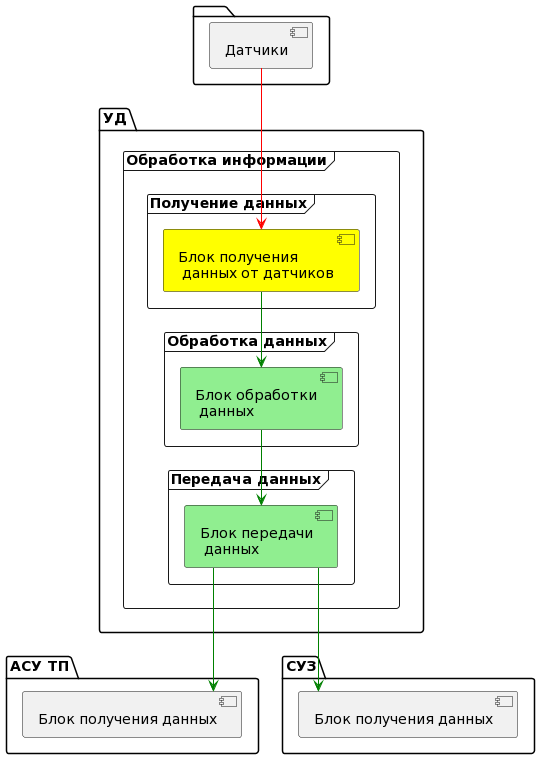
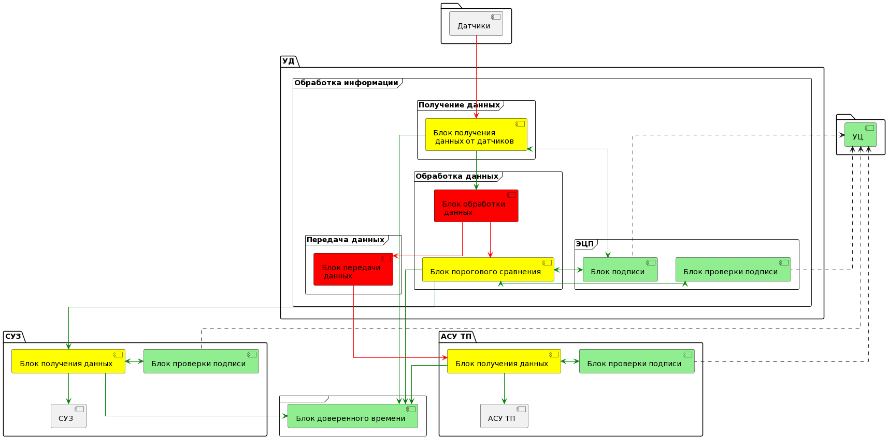

### Диаграмма взаимодействия компонентов обработки данных

Рассмотрим базовую диаграмму потоков данных, как в примерах. Из разборов следует, что блок получения данных должен повышать доверие к данным, а блоки обработки и передачи данных должны быть доверенными.

Таким образом, весь код блока УД нужно будет проверять.

### Предложения по изменению архитектуры обработки данных

Такой вариант схемы недостаточно отражает условия по проектированию защищенной системы киберимунным подходом, поэтому предлагается детализировать диаграмму.

Для обеспечения целостности данных предполагается использовать алгоритмы электронной цифровой подписи и проверки. Для этого также потребуется доверенный удостоверяющий центр вне УД, а также дополнительные элементы в СУЗ и АСУ ТП по проверке входящих данных, обладающих цифровой подписью.

Также для невозможности дублирования пакетов злоумышленником предлагается использовать модуль доверенного времени, которое также потребуется в системе журналирования.

Несмотря на то, что доверенных и повышающих доверие компонентов стало больше, однако, были выделены блоки, которые могут остаться недоверенными и могут содержать большую часть кода по передачи данных в различных форматах. При этом код повышающих доверие компонентов невелик. Объем кода криптографических блоков подписи и проверки подписи зависит от реализации. Для этого планируется отдельный блок информации.

В данной схеме потенциально можно блок порогового сравнения сделать недоверенным компонентом с соответствующей переделкой блока подписи в компонент, повышающий доверие, но код данного компонента небольшой, и выгода от его недоверенности не ощутима.

Стоит также заметить, что УЦ в данной схеме ни с какими блоками не взаимодействует и имеет лишь ассоциации, заключающиеся в том, что для работы предложенной схемы требуется стандартное распределение открытых (для блоков проверки подписи) и закрытых (для блока подписи) ключей.

Блоки доверенного времени и УЦ скорее всего не имеют существенных накладных расходов по интеграции, так как такие элементы предположительно уже существуют в инфраструктуре.

