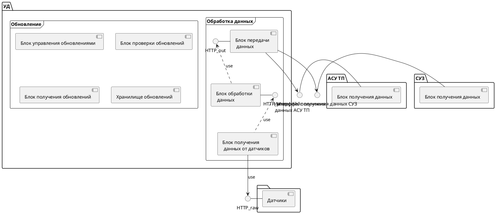

## Схема компонентов

```plantuml
@startuml

() HTTP_raw
package {
HTTP_raw - [Датчики]
}

package "УД" {
  frame "Обработка данных" {
() HTTP_proc
() HTTP_out
Component "Блок получения\n данных от датчиков" as DI
Component "Блок обработки\n данных" as DProc
Component "Блок передачи\n данных" as DOut
DI --> () HTTP_raw : use
() HTTP_proc <.. DI : use
[DProc] - () HTTP_proc
() HTTP_out <.. DProc : use
[DOut] - () HTTP_out 
  }

  frame "Обновление" {
    Component "Блок управления обновлениями" as UPDMgr
    Component "Блок проверки обновлений" as UPDVerifier
    Component "Блок получения обновлений" as UPDDownloader
    Component "Хранилище обновлений" as UPDStorage
  }

}
DOut --> () HTTP_scada
DOut --> () HTTP_protect

() "Интерфейс получения\n данных АСУ ТП" as HTTP_scada
package "АСУ ТП" {
Component "Блок получения данных" as SCADAIn
[SCADAIn] - ()HTTP_scada
}

() "Интерфейс получения данных СУЗ" as HTTP_protect
package "СУЗ" {
Component "Блок получения данных" as PROTECTIn
[PROTECTIn] - () HTTP_protect
}

@enduml
```
